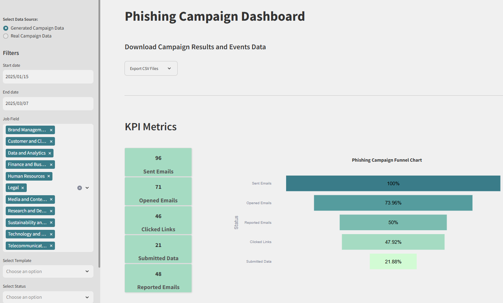
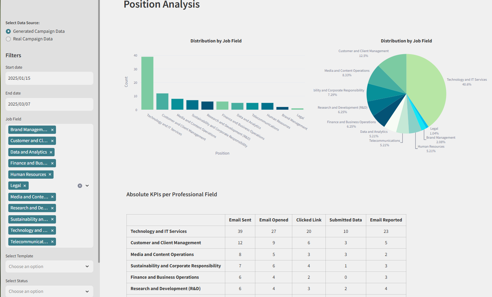

# Streamlit Dashboard for GoPhish Campaign Analysis


This repository provides a Streamlit-based dashboard that complements the GoPhish application this repository: https://github.com/kvnpotter/phishing-analysis. The dashboard fetches campaign data via the GoPhish API, allowing users to download events and results of all campaigns as CSV files. It also offers visualizations of key performance indicators (KPIs) such as the proportion of emails sent, opened, and links clicked, with filtering options by date, professional field, status, and more.
A demonstration of the dashboard based on the provided synthetic data can be found here: https://gophish-analysis.streamlit.app/.

## Features
* **Data Fetching:** Retrieves campaign data from the GoPhish application using the GoPhish API.
* **CSV Export:** Allows downloading of campaign events and results as CSV files.
* **Interactive Visualizations:** Displays KPIs with filtering options for in-depth analysis.


## File Structure

```plaintext

    phishing-analysis/
    ├── .streamlit/
    │   └── config.toml
    ├── generated_results/
    │   ├── generated_events.csv
    │   └── generated_results.csv
    ├── streamlit_app/
    │   ├── data_loader.py
    │   ├── filters.py
    │   ├── gophish_utils.py
    │   ├── kpi_calculations.py
    │   └── visualization.py
    ├── .gitignore
    ├── LICENSE
    ├── README.md
    ├── mail.png
    ├── requirements.txt
    ├── streamlit_app_main.py
    ├── streamlit_app_w_config.py
    └── config.json

```

* `/.streamlit/`
  
  * `config.toml`: Configuration file for Streamlit settings.
  
* `/generated_results/`
  
  * `generated_events.csv`: CSV file containing generated campaign events.
  
  * `generated_results.csv`: CSV file containing generated campaign results.
  
* `/streamlit_app/`

  * `data_loader.py`: Handles data loading from the GoPhish API and data preprocessing.
  
  * `filters.py`: Manages filtering options for the dashboard.
  
  * `gophish_utils.py`: Utility functions for interacting with the GoPhish API.

  * `kpi_calculations.py`: Computes key performance indicators.
  
  * `visualization.py`: Generates visual representations of the data.
  
* `.gitignore`: Specifies files and directories to be ignored by Git.

* `LICENSE`: License information for the repository.
  
* `README.md`: This README file.
  
* `mail.png`: Logo image used in the dashboard.
  
* `requirements.txt`: Lists Python dependencies required for the project.
  
* `streamlit_app_main.py`: Main application script for the online deployed Streamlit version.
  
* `streamlit_app_w_config.py`: Main application script for the locally deployed version.
  
* `config.json`: Template file for storing the GoPhish API key.*

## Getting Started

1. **Clone the Repository:**
   ```bash
    git clone https://github.com/Miriam-Stoehr/phishing-campaign-analysis.git
   ```

2. **Navigate to the Project Directory:**
   ```bash
    cd phishing-campaign-analysis
   ```

3. **Install Dependencies:** Ensure you have Python installed, then install the required packages:
   ```bash 
    pip install -r requirements.txt
   ```

4. **Configure the API Key:**
   * Configure your API key for the Gophish application
   * Add your Gophish API key to `config.json`:

   ```bash
    {
        "GOPHISH_API_KEY": "your_gophish_api_key"
    }
   ```

5. **Run the Dashboard:**
   * For the locally deployed version:
    ```bash
        streamlit run streamlit_app_w_config.py
    ```
   * For the online deployment:
     * Create an account at Streamlit.
     * Follow the instructions to deploy your cloned GitHub repository.

## Usage

* **Data Loading:** The dashboard will automatically fetch campaign data from the GoPhish application upon startup.
* **Filtering:** Use the sidebar to filter data by date, professional field, status, and other parameters.
* **Exporting Data:** Click the "Download CSV" button to export the current view of events and results.

## Acknowledgements

This dashboard was created for a use-case provided by Proximus Ada, the first Belgian center of excellence combining artificial intelligence and cybersecurity, within the BeCode Data Science and AI Bootcamp 2024/2025.

## Screenshots




